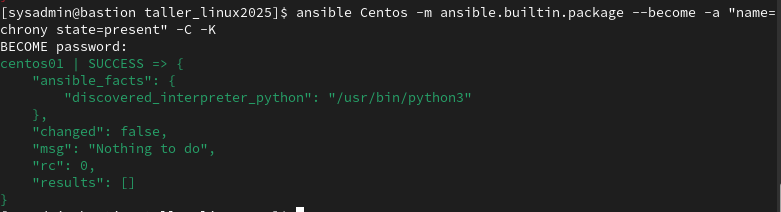
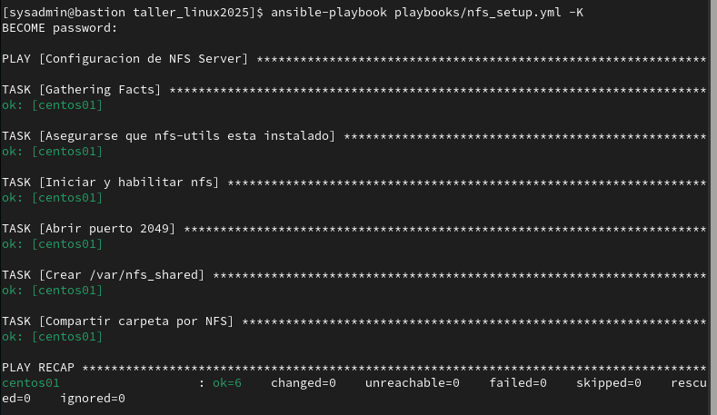

# Universidad ORT Uruguay

# Facultad de Ingeniería: Escuela de Tecnología

# Taller Servidores Linux

Andrés Acosta Andrade N.º 241131
Martina De Leon Balbiani N.º 254416


`git@github.com:AA241131/taller_linux2025.git`

08/08/2025

---

## Objetivo
Aplicar los conocimientos básicos de Ansible sobre dos distribuciones Linux: 
* CentOS Stream 9
* Ubuntu 24.04

---

1. ### Instalación de Servidores

    1. #### bastion

        Se crea el servidor bastión usando la distribución CentOS Stream 9 con las siguientes características: 

        * 2 CPU
        * 4 GB de RAM
        * 20 GB de disco
        * 2 interfaces de red, una en NAT y la otra interna. 

        | Punto de Montage  | Capacidad |
        | ------------- |:-------------:|
        | /boot         | 1             |
        | /             | 10            |
        | /var          | 5             |
        | SWAP          | 4             |
        | Total         | 20            |

        

        Se actualiza el servidor con `sudo dnf upgrade` tras la instalación. 
        Activamos la interfaz interna (enp0s8) y le asignamos la dirección ipv4 192.168.1.1/24
        

        ```
        sudo nmcli connection add con-name red_interna ifname enp0s8 type ethernet ip4 192.168.1.1/24 ipv6.method disabled
        ```

    2. #### centos01
        Se crea el servidor centos01 usando la distribución CentOS Stream 9 con las siguientes características: 

        * 1 CPU
        * 2 GB de RAM
        * 20 GB de disco
        * 2 interfaces de red, una en NAT y la otra interna. 
        
        La selección de software usada es Minimal, root deshabilitado, y sysadmin como usuario administrador con la password del curso. 
        
        Las particiones son idénticas a bastion: 
        | Punto de Montage  | Capacidad |
        | ------------- |:-------------:|
        | /boot         | 1             |
        | /             | 10            |
        | /var          | 5             |
        | SWAP          | 4             |
        | Total         | 20            |
        
        

        Activamos la interfaz interna (enp0s8) y le asignamos la dirección ipv4 192.168.1.1/24
        ```
        sudo nmcli connection add con-name red_interna ifname enp0s8 type ethernet ip4 192.168.1.2/24 ipv6.method disabled
        ```
        o en caso de que ya exista y esté en dhcp: 
        ```
        sudo nmcli connection modify enp0s8 con-name red_interna ifname enp0s8 type ethernet ipv4.method manual ip4 192.168.1.2/24 ipv6.method disabled
        ```

    3. #### ubuntu01
        Se crea el servidor ubuntu01 usando la distribución Ubuntu 24.04, con las mismas características que centos01:
        * 1 CPU
        * 2 GB de RAM
        * 20 GB de disco
        * 2 interfaces de red, una en NAT y la otra interna. 

        La base elegida para el servidor es Ubuntu Server, root está deshabilitado por defecto, y se crea el usuario administrador sysadmin con la password del curso. Se elije la opción de instalar OpenSSH server. 

        Las particiones son idénticas a bastion: 

        | Punto de Montage  | Capacidad |
        | ------------- |:-------------:|
        | /boot         | 1             |
        | /             | 10            |
        | /var          | 5             |
        | SWAP          | 4             |
        | Total         | 20            |

        

        Le asignamos la dirección de red 192.168.1.3/24
        
        Contenido de `/etc/netplan/50-cloud-init.yaml` :
        ```
        network: 
            version: 2
            ethernets:
                enp0s3:  
                dhcp4: true
                enp0s8: 
                dhcp4: no
                dhcp6: no
                addresses: 
                    - 192.168.1.3/24
                link-local: [ ipv4 ]
        ```

        Ejecutamos `sudo netplan apply`.

    4.  #### Configuración SSH
        
        Generamos las llaves pública/privada para el usuario ansible en el bastión: 
        `ssh-keygen`
        
        
        
        Copia de llave a centos01 y ubuntu01
        ```
        ssh-copy-id -i .ssh/id_rsa.pub 192.168.1.2
        ssh-copy-id -i .ssh/id_rsa.pub 192.168.1.3
        ```
        

2. ### Configuración de archivo de inventario de Ansible
    Instalación de Ansible

    `sudo dnf install ansible-core -y`

    Creación de directorio del proyecto

    `mkdir /home/sysadmin/taller_linux2025`

    Contenido de `~/taller_linux2025/ansible.cfg`:
    
    ```
    [defaults]
    inventory = ./inventory.ini  ; archivo con hosts
    ```

    Contenido de ~/taller_linux2025/inventory.ini:
    
    ```
    [Centos]
    centos01 ansible_host=192.168.1.2

    [Ubuntu]
    ubuntu01 ansible_host=192.168.1.3

    [webserver]
    centos01

    [Linux:children]
    Centos
    Ubuntu

    [all:vars]
    ansible_user=sysadmin
    ```

    Salida de `ansible-inventory -i inventory.ini --list`:

    

    Salida de `ansible all -i inventory.ini -m ping`:

    


3. ### Ejecución de comandos ad-hoc
    La ejecución de comandos ad-hoc se realiza con la siguiente sintaxis:
    `$ ansible [pattern] -m [module] -a "[module options]"`

    1. #### Listado de Usuarios
        Para listar todos los usuarios en el servidor Ubuntu usamos el módulo `ansible.builtin.shell`. Al ya tener el inventario cargado en `ansible.cfg` ya no es necesario específicar la ubicación del archivo `inventory.ini`: 

        `ansible Ubuntu -m ansible.builtin.shell -a "cat /etc/passwd" `

        devuelve el contenido de passwd. Necesitamos que el dígito luego del segundo : sea mayor o igual a 1000, o sea, 4 dígitos, distinto de nobody. 

        ```
        ansible Ubuntu -m ansible.builtin.shell -a "cat /etc/passwd" | grep -P "^[^:]*:x:\d\d\d\d" | cut -d ":" -f1 | grep -v "nobody"
        ```

        

    2. #### Uso de memoria
        Listamos el uso de memoria RAM en todos los servidores 
        `ansible all -m ansible.builtin.setup -a "filter=ansible_memory_mb"`

        

    3. #### Estado del servicio chronyd
        Para chequear si un paquete existe podemos usar el módulo `ansible.builtin.package_facts`.
        ```
        ansible Centos -m ansible.builtin.package_facts | sed '1c\{' | jq '.ansible_facts.packages.chrony'
        ```
        

        Alternativamente podemos usar `ansible.builtin.package` con el parámetro C para chequear sin modificar:

        `ansible Centos -m ansible.builtin.package --become -a "name=chrony state=present" -C -K`

        

        Si el objetivo es asegurarnos que el paquete esté instalado, usamos el mismo comando sin el parámetro C: 

        `ansible Centos -m ansible.builtin.package --become -a "name=chrony state=present" -K`

        Usamos el módulo `ansible.builtin.service_facts` para recopilar datos de los servicios, sed para formatear la salida, y jq para filtrar el json: 

        ```
        ansible Centos -m ansible.builtin.service_facts | sed '1c\{' | jq '.ansible_facts.services."chronyd.service"
        ```

        

        Alternativamente, podemos usar `ansible.builtin.systemd_service` con el parámetro `name=chronyd` para chequear el estado. 

        `ansible Centos -m ansible.builtin.systemd_service -a "name=chronyd"`


        Si el objetivo es modificar el estado del servicio, usamos el mismo módulo con los siguientes parámetros: 
        
        ```
        ansible Centos -m ansible.builtin.systemd_service -a "name=chronyd enabled=true state=started"
        ```
        
        
4. ### Creación y Ejecución de playbooks de Ansible
    
    Se crearán dos playbooks en el directorio `~/taller_linux2025/playbooks`

    Contenido de requirements.yml

    ```
    ---
    collections:
      - name: ansible.posix
        version: "1.5.4"
      - name: community.general
        version: "9.5.10"
    ```

    Ejecutamos `ansible-galaxy collection install -r requirements.yml` para instalar `ansible.posix`, requerido por el módulo de `firewalld`.

    1. #### `nfs_setup.yml`

        Esta playbook se va a ejecutar en un CentOS. 

        Objetivos:
        * Paquete `nfs-utils` instalado
        * Puerto 2049 abierto
        * `/var/nfs_shared` con usuario/grupo nobody/nobody, permisos 777
        * `/var/nfs_shared` está compartido por NFS
        * si `/etc/exports` cambia debe ser releído (`exportfs -r`)

        Contenido de `nfs-setup.yml`: 

        ```
        --- 
        - name: Configuracion de NFS Server
          hosts: Centos
          become: true
  
          tasks:
          - name: Asegurarse que nfs-utils esta instalado
            ansible.builtin.package:
              name: nfs-utils
              state: present

          - name: Iniciar y habilitar nfs
            ansible.builtin.service:
              name: nfs-server
              enabled: true
              state: started

          - name: Abrir puerto 2049
            ansible.posix.firewalld:
              service: nfs
              permanent: true
              immediate: true
              state: enabled
      
          - name: Crear /var/nfs_shared
            ansible.builtin.file:
              path: /var/nfs_shared
              state: directory
              owner: nobody
              group: nobody
              mode: '777'
        
          - name: Compartir carpeta por NFS
            ansible.builtin.lineinfile:
              path: /etc/exports
              line: /var/nfs_shared/  *(rw,sync,no_subtree_check)
              state: present
            notify:
              - Releer /etc/exports    

          handlers: 
            - name: Releer /etc/exports
              ansible.builtin.shell:
                cmd: exportfs -r
        ```
        
        Chequeamos sintaxis con `ansible-playbook playbooks/nfs_setup.yml --syntax-check`

        Ejecutamos `ansible-playbook playbooks/nfs_setup.yml -K`
                
        

        Ejecutamos de nuevo para confirmar que la tarea `Releer /etc/exports` no se activa, y no se hacen cambios. 

        
        
    2. #### `hardening.yml`
        Objetivos:
        * Actualizar todos los paquetes
        * ufw activo, solo permite ssh (22)
        * solo se permite login con clave pública, root no puede hacer login
        * fail2ban instalado, bloqueando intentos fallidos por SSH. Activo y habilitado
        * si se actualizan paquetes, reiniciar
        * si cambia configuración, reiniciar ssh

        Contenido de `~/taller_linux2025/jail.local`

        ```
        [sshd]
        enabled = true
        ```

        Contenido de `hardening.yml`: 

        ```
        ---
        - name: Actualizar y hardenizar Ubuntu
          hosts: Ubuntu
          become: true

          tasks:
          - name: Actualizar paquetes
            ansible.builtin.apt:
              name: "*"
              state: latest
              notify: Reiniciar el equipo

          - name: Configurar Firewall
            community.general.ufw:
              state: enabled
              default: deny
              rule: allow
              port: ssh
              proto: tcp

          - name: Login con clave publica, root no puede login
            ansible.builtin.lineinfile:
              path: /etc/ssh/sshd_config.d/50-cloud-init.conf
              backrefs: true # no insertar la linea si no hay matches
          regex: "^PasswordAuthentication yes"
          line: |
                PasswordAuthentication no 
                PermitRootLogin no       
            notify: Reiniciar SSH

          - name: Instalar fail2ban
            ansible.builtin.package:
              name: fail2ban
              state: present

          - name: Configurar fail2ban
            ansible.builtin.copy:
              src: ~/taller_linux2025/jail.local
              dest: /etc/fail2ban/jail.local

          - name: Iniciar y habilitar fail2ban
            ansible.builtin.service:
              name: fail2ban
              enabled: true
              state: started

          handlers: 
            - name: Reiniciar el equipo
              ansible.builtin.reboot:

            - name: Reiniciar SSH
              ansible.builtin.service:
                name: sshd
                state: restarted
        ```

        Probar sintaxis: 
        
        

        Ejecutar playbook

        `ansible-playbook playbooks/hardening.yml -K`
        
        
        
5. ### Cuestionario
    1. #### ¿Qué es Ansible?
        Ansible es un software utilizado para automatizar la gestión de sistemas remotos y controlar su estado final mediante declaraciones de estado. 
    2. #### ¿Qué es un playbook?
        Un playbook es una receta que define estados y configuraciones, la cual puede ser reutilizada en el mismo u otros sistemas, obteniendo resultados idénticos. 
    3. #### ¿Qué información contiene un inventario de Ansible?
        Un inventario es una manera prolija de definir hosts, grupos y variables, para luego utilizar estas definiciones tanto en playbooks como en ejecuciones ad-hoc. 
    4. #### ¿Qué es un módulo de Ansible?
        Un módulo es una unidad de código que puede controlar recursos del sistema, o ejecutar comandos. Existen módulos ya creados que permiten interactuar con diferentes partes de un sistema, y realizar tareas específicas, lo cual facilita mucho la creación de playbooks. 
    5. #### ¿Qué ventajas tiene Ansible sobre otros métodos de automatización?
        Facilidad de uso, simplicidad, seguridad y confiabilidad. No usa un agente, lo cual lo hace más fácil de mantener y ejecutar. 
6. ### Anexo
    
    Prueba de bloqueo de ssh y fail2ban según definimos en hardening.yml
    
    1. #### PasswordAuthentication
          
        Creamos un usuario test en ubuntu01

        ```
        useradd --comment "usuario de prueba" --no-create-home --password $(openssl passwd -salt sal prueba) testuser
        ```

        el archivo `/etc/ssh/sshd_config.d/50-cloud-init.conf` tiene preferencia sobre `/etc/ssh/sshd_config`, por lo que hay que deshabilitar editar la línea ahí, o borrarla. 
        
        

        Probamos el login y confirmamos que falla: 
          
        
          
    2. #### PermitRootLogin
        La cuenta root está bloqueada por defecto en Ubuntu: 

        

        La desbloqueamos y asignamos el password del curso: 

        `passwd -u root`

        Confirmamos que podemos loguearnos con ella:

        

        Modificamos `/etc/ssh/sshd_config.d/50-cloud-init.conf` agregando la línea `PermitRootLogin no`, reiniciamos el servicio ssh, `systemctl restart ssh`. 

        Intentamos nuevamente y el login es bloqueado: 

        

    3. #### fail2ban
        Activamos el login por password, y forzamos un error 5 veces. La conexión se rechazada:

        

        Vemos la confirmación de la ip bloqueada en ubuntu01 con el comando `fail2ban-client status sshd`:

        

        `nft list ruleset`

        

        Luego de los 10 minutos vemos que la ip ya no está bloqueada: 

        

        

7. ### Referencias
    https://docs.redhat.com/en/documentation/red_hat_enterprise_linux/9/html/configuring_and_managing_networking/configuring-an-ethernet-connection_configuring-and-managing-networking
    https://documentation.ubuntu.com/server/explanation/networking/configuring-networks/
    https://www.redhat.com/en/blog/configure-ssh-keygen
    https://docs.ansible.com/ansible/latest/reference_appendices/config.html
    https://docs.ansible.com/ansible/latest/reference_appendices/general_precedence.html
    https://docs.ansible.com/ansible/latest/inventory_guide/intro_inventory.html
    https://docs.ansible.com/ansible/latest/command_guide/intro_adhoc.html
    https://regex101.com/
    https://www.gnu.org/software/sed/manual/sed.html
    https://hostman.com/tutorials/using-the-jq-command-to-process-json-on-the-command-line/
    https://docs.ansible.com/ansible/latest/collections/ansible/builtin/package_module.html
    https://docs.ansible.com/ansible/latest/collections/ansible/builtin/package_facts_module.html
    https://docs.redhat.com/en/documentation/red_hat_enterprise_linux/8/html/deploying_different_types_of_servers/deploying-an-nfs-server_deploying-different-types-of-servers
    https://docs.ansible.com/ansible/latest/collections/ansible/posix/firewalld_module.html
    https://galaxy.ansible.com/ui/repo/published/ansible/posix/docs/
    https://docs.redhat.com/en/documentation/red_hat_enterprise_linux/9/html/configuring_firewalls_and_packet_filters/using-and-configuring-firewalld_firewall-packet-filters
    https://docs.ansible.com/ansible/latest/collections/ansible/builtin/file_module.html
    https://docs.ansible.com/ansible/latest/collections/ansible/builtin/lineinfile_module.html
    https://docs.redhat.com/en/documentation/red_hat_enterprise_linux/6/html/storage_administration_guide/nfs-serverconfig#nfs-serverconfig-exports
    https://docs.ansible.com/ansible/latest/playbook_guide/playbooks_handlers.html
    https://docs.ansible.com/ansible/latest/collections/ansible/builtin/shell_module.html
    https://docs.ansible.com/ansible/latest/playbook_guide/playbooks_privilege_escalation.html
    https://docs.ansible.com/ansible/latest/collections/ansible/builtin/apt_module.html
    https://docs.ansible.com/ansible/latest/collections/community/general/ufw_module.html
    https://docs.ansible.com/ansible/latest/playbook_guide/playbooks_loops.html
    https://help.ubuntu.com/community/Fail2ban
    https://github.com/fail2ban/fail2ban/wiki/Proper-fail2ban-configuration
    https://docs.ansible.com/ansible/latest/collections/ansible/builtin/copy_module.html
    https://www.redhat.com/en/ansible-collaborative/how-ansible-works

